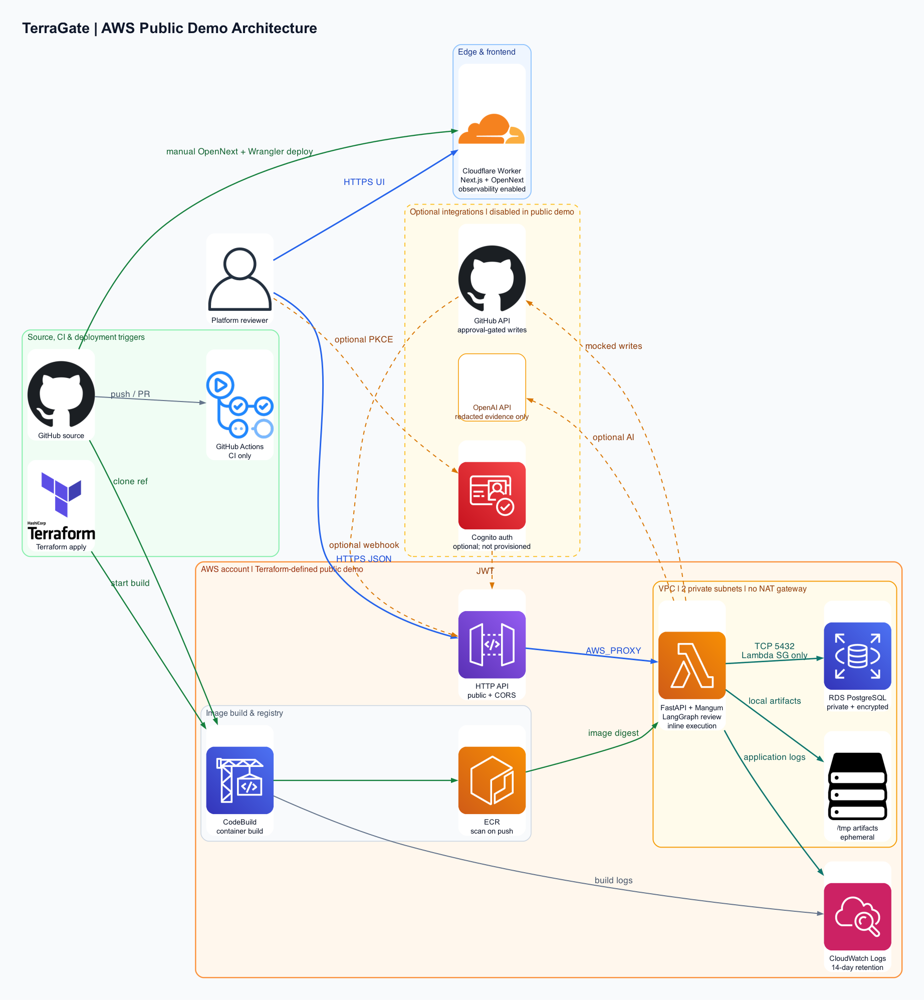

# TerraGate

TerraGate is a production-style Terraform PR risk gate for reviewing infrastructure changes before they merge. It parses Terraform plan JSON, redacts sensitive values, runs deterministic security/cost/reliability/governance checks, uses a LangGraph workflow to enrich and rank findings, persists review history, drafts a GitHub PR comment, and requires human approval before posting or committing suggested fixes.

**Positioning:** AI-assisted Terraform review that treats policy evidence as the source of truth and LLM output as explanation, remediation, and workflow acceleration.

## TL;DR

- **What it is:** An AI-assisted Terraform PR reviewer for cloud/platform teams.
- **What it does:** Turns Terraform plan JSON or sandbox-generated plans into evidence-backed risk findings, remediation guidance, check status, and approval-gated GitHub comments.
- **Why it is credible:** It uses deterministic policy checks first, redacts artifacts before AI review, persists runs/findings/evidence, has Alembic migrations, tests, CI, Docker Compose, GitHub integration, and Cognito-ready auth.
- **Live demo:** [https://terragate.hangi87.workers.dev](https://terragate.hangi87.workers.dev)
- **Example run:** [Critical risky-security review](https://terragate.hangi87.workers.dev/runs/run_8182267f6ba84b629a)

## Problem

Terraform PR review is slow because reviewers have to reconstruct blast radius, security exposure, cost impact, and operational risk from scattered plan output, code diffs, tags, and tribal knowledge. Generic AI review is not trustworthy enough on its own because Terraform plan JSON can contain sensitive values and because hallucinated infrastructure findings create review noise.

## Solution

TerraGate turns a Terraform plan into a review workflow: parse and redact the plan, run deterministic checks, map findings to evidence and PR context, rank risk, generate remediation/runbook guidance, draft one clean PR comment, and block all external writes until a human approves them.

## Operational Value

- Reduces manual review time by turning plan JSON into prioritized findings with evidence.
- Reduces cloud risk by catching public ingress, destructive stateful changes, missing backups, weak tags, and cost surprises before merge.
- Preserves reviewer control by requiring explicit approval before comments or patch commits.
- Keeps sensitive data out of optional LLM calls by redacting raw artifacts and sending reduced evidence summaries.

## About

This project is built for platform engineers, SREs, DevOps teams, and security reviewers who need faster infrastructure change review without trusting an LLM to guess from raw files. **Review Terraform PR** is the primary workflow. Runbook and compliance views reuse the same persisted findings and evidence; broader incident and cost-optimization workflows remain out of scope.

The core product philosophy is deterministic first, AI second:

1. Parse Terraform plan JSON.
2. Redact sensitive values.
3. Extract normalized resource changes.
4. Run deterministic policy checks.
5. Use reviewer nodes to explain, prioritize, and generate remediation from structured evidence.
6. Require human approval before GitHub writes.

## Screenshots And Diagrams

The public-demo architecture diagram is generated from repository-owned source and reflects the AWS/Cloudflare deployment shape defined in this repo.



UI screenshots are intentionally not checked in unless generated from the running app. Use the live demo link above or the local quickstart below to inspect the current dashboard.

## Tech Stack

| Area | Technology |
| --- | --- |
| Frontend | Next.js 16, React 19, TypeScript, Tailwind CSS, lucide-react |
| Backend API | FastAPI, Pydantic, SQLAlchemy |
| Agent workflow | LangGraph, LangChain, optional OpenAI model calls |
| Database | PostgreSQL in Docker Compose, SQLite fallback for local/manual runs |
| Migrations | Alembic |
| Auth | Dev role-header fallback, Amazon Cognito JWT/Hosted UI integration path |
| Artifact storage | Local filesystem adapter for dev, structured for future object storage |
| GitHub | PR metadata, webhook endpoint, check runs, comments, approved patch commits, mock fallback |
| Cost | Optional Infracost CLI, deterministic heuristic fallback |
| Observability | Optional LangSmith tracing, audit log records in the database |
| Local dev/deploy | Docker Compose, API/web Dockerfiles, GitHub Actions CI |
| Public demo hosting | Cloudflare Workers/OpenNext frontend, AWS API Gateway + Lambda/Mangum backend path |

## Engineering Highlights

- **Terraform-aware parser:** Validates `terraform show -json` output, extracts `resource_changes`, actions, providers, before/after state, and plan summary metrics.
- **Sensitive-data guardrails:** Redacts secret-like keys and PR patch snippets before AI review or artifact display.
- **Deterministic policy engine:** Implements security, cost, reliability, governance, and compliance-style checks with JSON-path evidence.
- **LangGraph workflow:** Runs named review nodes for ingestion, redaction, normalization, policy checks, cost estimate, blast-radius analysis, reviewer enrichment, merge/dedupe, PR mapping, remediation, compliance mapping, reporting, and approval gating.
- **Human-in-the-loop GitHub actions:** PR comments and suggested patch commits are blocked until approved.
- **Production-style persistence:** Stores runs, artifacts, findings, evidence, remediations, approvals, GitHub checks/comments, fix patches, review jobs, and audit events.
- **Async-capable execution:** Supports inline execution, FastAPI background tasks, and a worker process that claims queued review jobs from the database.
- **Operational risk analysis:** Detects destructive stateful changes and generates runbook-grade checklists for backup, maintenance window, rollback, owner signoff, and post-apply validation.
- **Hosted-demo guardrails:** Includes preloaded sample-review endpoints, upload size limits, sandbox disablement, read-only policy packs, and mock GitHub writes for public demos.
- **Engineering hygiene:** TypeScript checks, ESLint, pytest, a focused frontend regression test, Docker Compose, Alembic migrations, sample data, API contract docs, threat model, and ADRs.

## Evidence Matrix

| Area | Evidence |
| --- | --- |
| IaC | `infra/terraform/aws-public-demo` provisions API Gateway, Lambda container, ECR, CodeBuild, private RDS, VPC/subnets/security groups, log groups, and outputs. |
| CI/CD | `.github/workflows/ci.yml` runs backend tests, Alembic migration validation, frontend typecheck/lint/build, and Terraform fmt/validate. AWS backend deploy uses Terraform + CodeBuild; Cloudflare deploy uses OpenNext/Wrangler. |
| Security | Terraform plan and PR patch redaction, Cognito JWT support, dev-auth isolation for demos, private RDS, security-group scoped DB access, approval-gated GitHub writes, public-demo guardrails. |
| Reliability | Persisted run/job state, node-level graph progress, retry metadata, worker claim flow, explicit public-demo fallback behavior, documented failure modes and recovery. |
| Observability | CloudWatch log groups, Cloudflare Workers observability, persisted audit events, optional LangSmith tracing, graph progress visible in the UI. |
| Cost | Lambda/API Gateway request-driven backend, no NAT gateway in demo stack, stoppable small RDS, 14-day log retention, optional Infracost, documented low-idle public-demo path. |
| Operations | Runbook-grade remediation output, deployment docs, teardown docs, threat model, public demo guide, API contract, reviewer guide. |
| Testing | Pytest coverage for parser/redaction/policy/risk/API/auth/GitHub behavior, a frontend regression test, TypeScript/lint/build checks, and CI Terraform validation. |
| Documentation | Architecture docs, ADRs, tradeoffs, security, observability, cost model, testing, deployment, teardown, and reviewer guide. |

## Architecture

The implemented public-demo path serves the Next.js/OpenNext frontend from Cloudflare Workers. Browser requests call an AWS API Gateway HTTP API, which invokes a Mangum-wrapped FastAPI Lambda in private subnets. The backend runs the deterministic-first LangGraph review inline, stores ephemeral artifacts in Lambda `/tmp`, and persists review state and audit events in private, encrypted RDS PostgreSQL.

- **Request flow:** The reviewer loads the UI from Cloudflare Workers; the browser sends API calls directly to API Gateway -> FastAPI/Lambda -> review engine -> RDS. Optional GitHub, OpenAI, LangSmith, and Infracost adapters are disabled, mocked, or credential-dependent in the public-demo path.
- **Deployment flow:** Terraform provisions the AWS backend and starts CodeBuild, which clones the selected Git ref, builds `Dockerfile.lambda`, pushes to ECR, and supplies Lambda by image digest. The Cloudflare frontend deploy is a separate manual npm script. GitHub Actions runs tests and builds only; it does not deploy.
- **Security:** Lambda and RDS run in private subnets, RDS accepts port 5432 only from the Lambda security group, raw plans are redacted before optional AI review, and GitHub writes require human approval. Cognito support is optional and is not provisioned by the demo Terraform; the public demo uses dev auth.
- **Cost controls:** The stack uses request-driven Lambda/API Gateway, inline execution with no idle worker, no NAT gateway, a small RDS default, and 14-day log retention. Stopping RDS outside demos is a documented manual control, not an automated schedule.

Architecture docs:

- [AWS diagram source](docs/architecture_aws.py)
- [AWS diagram SVG](docs/architecture_aws.svg)
- [Mermaid diagram source](docs/architecture.mmd)
- [Architecture diagram notes and evidence](docs/architecture-notes.md)
- [Architecture overview and C4-style diagram](docs/architecture.md)
- [Hiring manager reviewer guide](docs/reviewer-guide.md)
- [Deployment guide](docs/deployment.md)
- [Operations runbook](docs/runbook.md)
- [Security model](docs/security.md)
- [Observability model](docs/observability.md)
- [Cost model](docs/cost-model.md)
- [Teardown guide](docs/teardown.md)
- [Testing guide](docs/testing.md)
- [Tradeoffs](docs/tradeoffs.md)
- [GitHub App onboarding plan](docs/github-app-onboarding.md)
- [S3/KMS artifact storage plan](docs/s3-artifact-storage.md)
- [Durable worker queue plan](docs/worker-queue.md)
- [Architecture Decision Records](docs/adrs/README.md)
- [Product readiness plan](docs/product-readiness.md)
- [Low-cost public demo deployment](docs/public-demo.md)
- [API contract](docs/api-contract.md)
- [Threat model](docs/threat-model.md)
- [Demo script](docs/demo-script.md)

## What Works Today

- Upload Terraform plan JSON.
- Optionally run Terraform plan generation from a configured sandbox directory.
- Fetch GitHub PR metadata and changed files when credentials are configured.
- Accept GitHub pull request webhooks for PR-native review triggers.
- Parse and summarize Terraform resource changes.
- Redact raw plan values and GitHub patch context.
- Run deterministic security, cost, reliability, governance, and compliance checks.
- Estimate cost with Infracost when configured, or a labeled heuristic fallback.
- Analyze blast radius for destructive stateful changes.
- Generate structured findings, evidence, remediations, compliance refs, and runbook checklist items.
- Generate a markdown GitHub PR comment draft.
- Require approval before posting comments or committing suggested fixes.
- Persist review history, audit log events, and graph progress.
- Scope run history and run actions to the authenticated user's organization.
- Run locally without OpenAI or GitHub credentials using deterministic and mock fallbacks.
- Launch bundled public-demo sample reviews without requiring visitors to upload Terraform plans.

## Project Structure

```text
apps/
  api/      FastAPI API, LangGraph workflow, persistence, integrations, tests
  web/      Next.js dashboard, review form, run detail, approvals, settings
docs/       Architecture, ADRs, API contract, threat model, demo script
infra/      Dockerfiles and Docker Compose
sample-data/terraform-plans/
            Safe, risky security, risky cost, and destructive prod plan fixtures
```

## Local Setup

### Option A: Docker Compose

```bash
cd terragate
cp .env.example .env
docker compose -f infra/docker-compose.yml up --build
```

Open:

- Web: `http://localhost:3000`
- API docs: `http://localhost:8000/docs`

Docker Compose runs PostgreSQL, the API, the worker, and the web app. Optional Redis and Qdrant services are defined behind Compose profiles for future expansion.

### Public Demo Mode

For a hosted public work-sample demo, enable the safe public path:

```bash
PUBLIC_DEMO_MODE=true
PUBLIC_DEMO_ALLOW_UPLOADS=true
PUBLIC_DEMO_MAX_UPLOAD_BYTES=1500000
PUBLIC_DEMO_DISABLE_SANDBOX=true
PUBLIC_DEMO_MOCK_GITHUB_WRITES=true
PUBLIC_DEMO_ALLOW_LIVE_GITHUB_READS=false
REVIEW_EXECUTION_MODE=inline
```

This keeps the full review workflow functional for bundled sample plans and optional capped uploads, while blocking expensive or risky actions such as Terraform sandbox execution and live GitHub writes. See [docs/public-demo.md](docs/public-demo.md) for the Cloudflare Workers + AWS API Gateway/Lambda deployment shape.

### Option B: Manual Local Run

Backend:

```bash
cd terragate/apps/api
python -m venv .venv
source .venv/bin/activate
pip install -r requirements.txt
uvicorn app.main:app --reload --port 8000
```

Frontend:

```bash
cd terragate/apps/web
npm install
npm run dev
```

Manual mode defaults to SQLite if `DATABASE_URL` is empty. Docker Compose uses PostgreSQL. The API runs Alembic migrations on startup; migrations can also be run manually from `apps/api` with `alembic upgrade head`.

## Demo Flow

Use the included sample plans:

```text
sample-data/terraform-plans/safe-plan.json
sample-data/terraform-plans/risky-security-plan.json
sample-data/terraform-plans/risky-cost-plan.json
sample-data/terraform-plans/destructive-prod-plan.json
```

Suggested walkthrough:

1. Start the app.
2. Open New Review.
3. Upload `sample-data/terraform-plans/risky-security-plan.json`.
4. Select `prod`, AWS, and the `default` policy profile.
5. Show graph progress, plan summary, severity breakdown, findings, evidence, remediation, and PR comment draft.
6. Try posting to GitHub before approval to show the approval gate.
7. Approve the draft.
8. Post to GitHub. Without credentials, the API returns a clear mock response.

## Environment

Copy `.env.example` to `.env`. Important variables:

| Variable | Purpose |
| --- | --- |
| `DATABASE_URL` | PostgreSQL connection string; SQLite fallback when empty in manual mode |
| `OPENAI_API_KEY` | Enables optional LLM reviewer enrichment |
| `LANGSMITH_API_KEY` / `LANGSMITH_PROJECT` | Optional LangSmith tracing |
| `GITHUB_TOKEN` or GitHub App variables | Enables live PR metadata, checks, comments, and approved patch commits |
| `INFRACOST_API_KEY` | Enables stronger Infracost-backed cost estimation |
| `AUTH_MODE` | `dev` or `cognito` |
| `COGNITO_*` and `NEXT_PUBLIC_COGNITO_*` | Cognito JWT validation and Hosted UI login |
| `TERRAFORM_SANDBOX_*` | Optional Terraform plan execution sandbox settings |
| `REVIEW_EXECUTION_MODE` | `inline`, `background`, or worker-backed execution |
| `PUBLIC_DEMO_*` | Enables hosted-demo guardrails, sample-review flow, upload limits, and mock external writes |

For Cognito, create a public app client without a client secret, enable authorization-code + PKCE, add `http://localhost:3000/auth/callback` as an allowed callback URL, and add `http://localhost:3000` as an allowed sign-out URL. Groups map to app roles by default: `terragate-admins`, `terragate-reviewers`, and `terragate-viewers`.

## Generating Terraform Plan JSON

```bash
terraform plan -out=tfplan.binary
terraform show -json tfplan.binary > tfplan.json
```

Terraform plan JSON can expose secrets and provider-generated values. Treat it as sensitive. The app redacts sensitive content before review nodes and before storing GitHub patch context, but raw uploaded artifacts should still be handled as sensitive data.

## Security And Privacy Guardrails

- Raw Terraform plans are never sent to the LLM.
- LLM reviewer nodes receive reduced evidence summaries, not full raw plans.
- Secret-like keys and PR patch snippets are redacted.
- Deterministic findings include concrete evidence and rule IDs.
- Low-confidence or high-risk findings can require human review.
- GitHub comments and suggested patch commits are approval-gated.
- Missing external credentials return mock/dev responses instead of failing the demo.
- Cognito mode validates signed JWTs and maps groups/custom claims to platform roles.

## GitHub Integration

When `repo_owner`, `repo_name`, and `pull_number` are supplied, the backend can fetch PR title, author, state, labels, reviewers, refs, latest head SHA, changed files, and Terraform file patches. Findings are heuristically mapped back to changed Terraform files when context is available.

The app can create GitHub check-run records, draft a single PR comment, post the approved comment, and commit approved suggested patches to same-repository PR branches. If credentials or safe PR metadata are missing, it records mock events and returns clear messages.

## Tests And CI

Backend:

```bash
cd apps/api
source .venv/bin/activate
python -m pytest
```

Frontend:

```bash
cd apps/web
npm test
npm run typecheck
npm run lint
npm run build
```

GitHub Actions runs backend pytest plus the frontend regression test, typecheck, lint, and build.

CI also validates Alembic migrations and Terraform formatting/validation for the AWS public-demo stack.

## Deployment Overview

- **Local:** Docker Compose runs API, web, worker, and PostgreSQL. Manual mode can use SQLite for quick API runs.
- **Public demo frontend:** Cloudflare Workers through OpenNext and Wrangler. The current repository includes `apps/web/wrangler.jsonc` and npm scripts for preview/deploy.
- **Public demo backend:** AWS API Gateway invokes a Mangum-wrapped FastAPI Lambda container. Terraform provisions private RDS PostgreSQL, ECR, CodeBuild, VPC networking, and log groups.
- **CI:** GitHub Actions validates code and Terraform but intentionally does not auto-deploy.

See [docs/deployment.md](docs/deployment.md) and [docs/public-demo.md](docs/public-demo.md).

## Security Model Summary

- Deterministic checks are authoritative; optional LLM calls receive redacted evidence summaries only.
- Terraform plan values and GitHub patch snippets are redacted before AI review or display in sensitive contexts.
- Public demo mode blocks live GitHub writes, Terraform sandbox execution, and policy-pack edits by default.
- Cognito JWT validation exists for private deployments, while the public demo uses dev auth and clearly labels it.
- GitHub comments/checks/patch commits are approval-gated and audited.
- Private RDS only accepts PostgreSQL traffic from the Lambda security group in the AWS demo stack.

See [docs/security.md](docs/security.md) and [docs/threat-model.md](docs/threat-model.md).

## Observability Model Summary

- Runs persist graph progress, node status, findings, approvals, GitHub action attempts, and audit events.
- Public-demo infrastructure writes Lambda and CodeBuild logs to CloudWatch with 14-day retention.
- Cloudflare Workers observability is enabled in `apps/web/wrangler.jsonc`.
- LangSmith tracing is optional through environment variables and disabled in the low-cost public-demo Terraform by default.

See [docs/observability.md](docs/observability.md).

## Cost Controls Summary

- Lambda/API Gateway are request-driven.
- The public-demo stack avoids a NAT gateway and separate always-on worker.
- RDS uses a small instance class and is documented as stoppable outside demos.
- Log retention is limited to 14 days.
- Infracost can provide stronger estimates; heuristic estimates are labeled when Infracost is unavailable.

See [docs/cost-model.md](docs/cost-model.md).

## Public Demo Performance

The public demo is optimized for very low idle cost, so the first API request after inactivity can be slower than a paid always-warm service. The likely causes are Lambda container cold start, FastAPI/database connection startup, and RDS connection warm-up.

The UI is designed to hide that cost from the first impression:

- The Cloudflare-hosted app shell, navigation, controls, and static trust signals render immediately.
- Dashboard metrics and run history load progressively with skeleton states instead of showing temporary zero values.
- The dashboard fetches persisted review history after the application shell is visible.
- The API imports the LangGraph/LangChain review workflow only when a review job executes, so simple health and dashboard endpoints avoid unnecessary heavy startup work.

This is a deliberate portfolio-demo tradeoff: keep idle spend low while preserving a credible user experience. A paid production deployment would add a durable queue, stronger caching, and optionally Lambda provisioned concurrency or an always-on service for stricter latency targets.

## Teardown And Cleanup

- Local containers can be stopped with Docker Compose.
- AWS public-demo resources are removed with `terraform destroy`.
- Cloudflare frontend resources are managed through Wrangler/Cloudflare.
- The demo stack is disposable by design: RDS deletion protection and final snapshot are disabled by default.

See [docs/teardown.md](docs/teardown.md).

## Known Limits

- The worker is database-polling, not a durable queue system such as SQS, Celery, or Temporal.
- Terraform sandboxing is useful for demos and trusted local environments, but it is not a hardened multi-tenant SaaS isolation boundary.
- Public demo mode intentionally disables sandbox execution by default; a serious multi-tenant hosted version should isolate Terraform execution in short-lived containers with no shared credentials.
- Cost estimates are strongest when Infracost is installed and configured; fallback estimates are intentionally labeled heuristic.
- Suggested patches are reviewable drafts and may need human editing before commit.
- Policy packs are editable JSON files, not yet a full approval/versioning workflow.
- Cognito auth is wired for JWT validation and Hosted UI, but persisted org membership and row-level authorization are future work.

## Roadmap

- Durable queue backend such as SQS or Temporal for customer-scale review execution.
- Tenant-isolated Terraform execution with short-lived cloud credentials and stronger sandbox boundaries.
- Policy-pack approval/versioning workflow with policy snapshots per run.
- S3/KMS artifact storage adapter with retention and deletion controls.
- OPA/Rego policy execution alongside Python checks.
- Chroma/Qdrant runbook retrieval for incident investigation and remediation context.
- LangSmith trace links in the UI.
- First-class GitHub App installation onboarding and repository registration.
