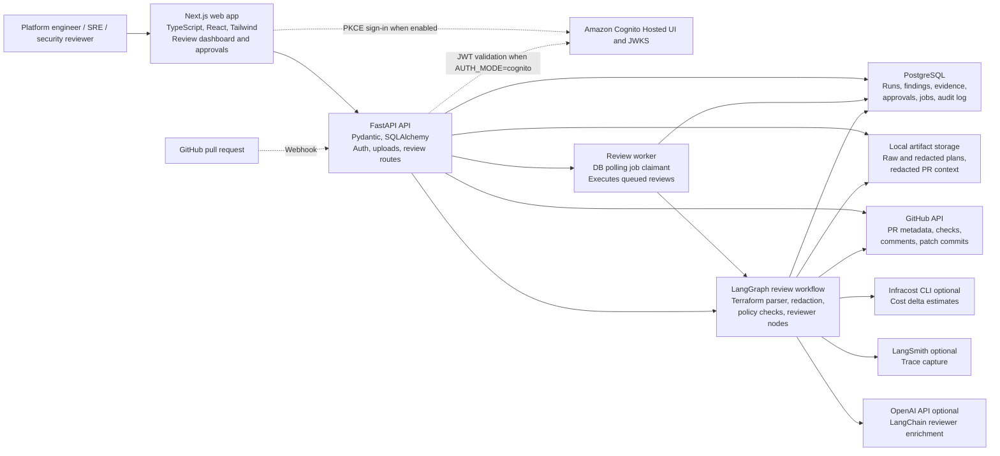

# Architecture

## TL;DR

TerraGate is a two-app monorepo: a Next.js dashboard calls a FastAPI backend that stores review state in PostgreSQL, artifacts on disk, and runs a LangGraph workflow for Terraform PR review. The backend uses deterministic policy checks before LLM enrichment, persists graph progress and findings, and gates all GitHub writes behind human approval.

## System Overview

The product is organized around the Terraform PR review workflow. A user uploads a Terraform plan JSON file, triggers sandbox plan generation, or receives a GitHub webhook-triggered review. The API stores the input artifact, queues a review job, executes a LangGraph workflow, persists structured findings and reports, and exposes the results to the dashboard.

Key responsibilities:

- **Web app:** Review intake, run history, findings table, approval center, settings, and policy-pack editing.
- **API:** Auth boundary, plan validation, artifact storage, review orchestration, persistence, and integration endpoints.
- **Worker:** Claims queued review jobs from the database and executes the same graph as inline/background mode.
- **LangGraph workflow:** Redaction, normalization, deterministic checks, optional AI explanation, remediation, compliance mapping, report generation, and approval gate.
- **Database:** Run history, review jobs, findings, evidence, remediations, approvals, suggested patches, GitHub check/comment records, and audit log events.

## C4-Style Container Diagram

## Runtime Flow

1. A user starts a review by uploading Terraform plan JSON, selecting sandbox plan execution, or triggering a GitHub PR webhook.
2. The API authenticates the actor. In dev mode it uses local role headers. In Cognito mode it validates a signed bearer token.
3. The API validates Terraform plan shape and writes the raw artifact to local artifact storage.
4. If GitHub repo context exists, the API fetches PR metadata and changed files, redacts patch snippets, and stores a `github_pr_context` artifact.
5. A `runs` row and `review_jobs` row are created with a persisted execution payload.
6. Execution happens inline, as a FastAPI background task, or through `python -m app.worker`, depending on `REVIEW_EXECUTION_MODE`.
7. The LangGraph workflow streams node progress back into `runs.graph_progress`.
8. Deterministic checks create evidence-backed findings. Optional LLM reviewer nodes explain, group, and enrich findings without receiving raw plan content.
9. The graph builds a risk score, remediation summary, suggested patches, runbook checklist items, and a PR comment draft.
10. Results are persisted and the run enters `approval_pending`.
11. A reviewer approves or rejects the PR comment. Suggested patch commits require separate approval.
12. Approved actions can write to GitHub. Missing credentials or unsafe PR conditions return mock responses rather than mutating external systems.

## Deployment Shape

Local Docker Compose:

- `postgres`: primary database.
- `api`: FastAPI app.
- `worker`: queue claimant/executor using the same API image.
- `web`: Next.js app.
- `redis`: optional profile, reserved for future queue/cache work.
- `qdrant`: optional profile, reserved for future runbook retrieval.

Manual local mode:

- API can run against SQLite when `DATABASE_URL` is empty.
- Web app runs with `npm run dev`.
- External services are optional; mock fallbacks keep the demo working without OpenAI, GitHub, Infracost, or Cognito credentials.

Intended production direction:

- API and worker run as separate services.
- PostgreSQL remains the source of truth.
- Artifacts move from filesystem to object storage.
- Worker queue moves from DB polling to a durable queue.
- Terraform execution moves to stronger tenant isolation with short-lived cloud credentials.

## Key Constraints

- Terraform plan JSON is sensitive, so raw artifacts are treated as sensitive and are not sent to LLMs.
- The app does not trust LLM output as source of truth; deterministic checks create findings first.
- GitHub writes are externally visible and must remain approval-gated.
- Current worker mode is useful and observable, but not a durable queue system.
- Current sandbox mode is suitable for local/trusted demos, not hardened multi-tenant execution.
- Current policy packs are editable JSON files, not a mature approval/versioning workflow.
- Cognito auth validates JWTs and roles, but persisted org membership and row-level authorization are future work.

## Main Data Stores

- **PostgreSQL or SQLite:** Runs, jobs, findings, evidence, remediations, approvals, patches, checks, comments, and audit logs.
- **Local artifact storage:** Raw plan JSON, redacted plan JSON, and redacted GitHub PR context.
- **Policy pack JSON:** Team-editable policy profiles under `apps/api/app/policies/policy_packs`.

## Related Docs

- [ADR index](adrs/README.md)
- [API contract](api-contract.md)
- [Threat model](threat-model.md)
- [Demo script](demo-script.md)
