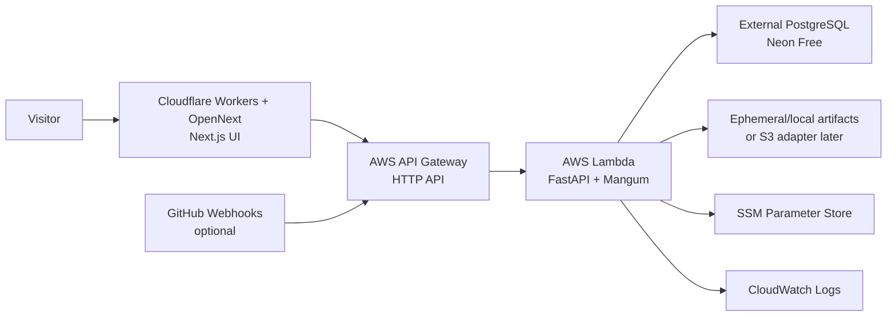

# Public Demo Deployment

## TL;DR

The cheapest useful hosted demo is Cloudflare Workers with OpenNext for the Next.js UI plus AWS API Gateway and Lambda for the FastAPI API. Public demo mode keeps the product demoable without exposing expensive or risky controls: visitors can launch bundled Terraform reviews, optionally upload small plan JSON files, approve draft comments, and see mock GitHub write behavior.

Live demo: [https://terragate.hangi87.workers.dev](https://terragate.hangi87.workers.dev)

## Target Shape



## Why This Option

This deployment maximizes end-user appeal per dollar:

- Cloudflare Workers with OpenNext keeps the dashboard fast and nearly free at idle while supporting the dynamic Next.js run-detail route.
- API Gateway and Lambda cost approximately nothing when nobody is using the demo.
- Neon Free keeps the small demo database cheap at idle without recreating RDS in Terraform.
- SSM Parameter Store is enough for non-rotating demo configuration and avoids Secrets Manager per-secret charges.
- The public demo does not need a worker process if reviews run inline against sample plans.

## Supported Demo Functions

| Function | Public demo behavior |
| --- | --- |
| Launch sample Terraform review | Fully supported through `/api/v1/demo/terraform-reviews` |
| Upload Terraform plan JSON | Supported when `PUBLIC_DEMO_ALLOW_UPLOADS=true`, capped by `PUBLIC_DEMO_MAX_UPLOAD_BYTES` |
| Deterministic checks | Fully supported |
| LangGraph workflow progress | Fully supported |
| Findings, evidence, remediation | Fully supported |
| Approval workflow | Fully supported and persisted |
| GitHub PR comment/check/patch write | Approval-gated mock by default |
| Live GitHub PR reads | Disabled by default; opt in with `PUBLIC_DEMO_ALLOW_LIVE_GITHUB_READS=true` |
| Terraform sandbox execution | Disabled by default |
| Policy-pack edits | Read-only in public demo mode |

## Lambda API

The API has a Mangum entrypoint at `app.lambda_handler.handler` and a Lambda container Dockerfile at `infra/Dockerfile.lambda`.

Recommended environment for the public demo Lambda:

```bash
APP_ENV=production
PUBLIC_DEMO_MODE=true
PUBLIC_DEMO_ALLOW_UPLOADS=true
PUBLIC_DEMO_MAX_UPLOAD_BYTES=1500000
PUBLIC_DEMO_MOCK_GITHUB_WRITES=true
PUBLIC_DEMO_ALLOW_LIVE_GITHUB_READS=false
PUBLIC_DEMO_DISABLE_SANDBOX=true
PUBLIC_DEMO_SAMPLE_DATA_DIR=/var/task/sample-data/terraform-plans
REVIEW_EXECUTION_MODE=inline
AUTH_MODE=dev
DATABASE_URL=postgresql+psycopg://...
ARTIFACT_STORAGE_DIR=/tmp/artifacts
CORS_ORIGINS=https://your-cloudflare-workers-subdomain.workers.dev
```

`REVIEW_EXECUTION_MODE=inline` is intentional for the cheapest public demo. Lambda background tasks are not a durable queue, and a separate always-on worker would defeat the idle-cost goal. A production SaaS version should replace this with SQS, Step Functions, Celery, or Temporal.

## Cloudflare Workers UI

The frontend is a client-fetching Next.js app and must receive the public API/auth values at build time:

```bash
NEXT_PUBLIC_API_BASE_URL=https://your-api-id.execute-api.us-east-1.amazonaws.com
NEXT_PUBLIC_AUTH_PROVIDER=dev
```

`apps/web/.env.production` pins the current public demo values so Cloudflare deploys do not accidentally build a browser bundle that falls back to `http://localhost:8000`.

Use Cloudflare's current Next.js SSR path with `@opennextjs/cloudflare` and Wrangler:

```bash
cd apps/web
NEXT_PUBLIC_API_BASE_URL=https://your-api-id.execute-api.us-east-1.amazonaws.com \
NEXT_PUBLIC_AUTH_PROVIDER=dev \
npm run deploy:cloudflare
```

The repo keeps the local/Docker build as standard Next.js `standalone` output so local review remains simple, while the Cloudflare deployment converts that build output through OpenNext.

For a public portfolio demo, keep Cognito off unless login is part of the demo. Cognito is still the right next step for private org/user permissions.

## Database Cost Control

For demos, use a small external PostgreSQL database such as Neon Free and pass its direct connection string as `DATABASE_URL` / Terraform `database_url`. The AWS Terraform stack intentionally does not create RDS, a VPC, or RDS Proxy.

## What This Does Not Claim

This is not yet a hardened multi-tenant SaaS deployment. Public demo mode deliberately avoids:

- Running arbitrary Terraform in a shared Lambda environment.
- Posting real comments or commits from unauthenticated visitors.
- Allowing anonymous policy-pack edits.
- Claiming durable background execution without a queue.

Those are solvable production features, but they add operational cost and maintenance. The public demo path is meant to make the product easy to try while preserving the architecture story.
